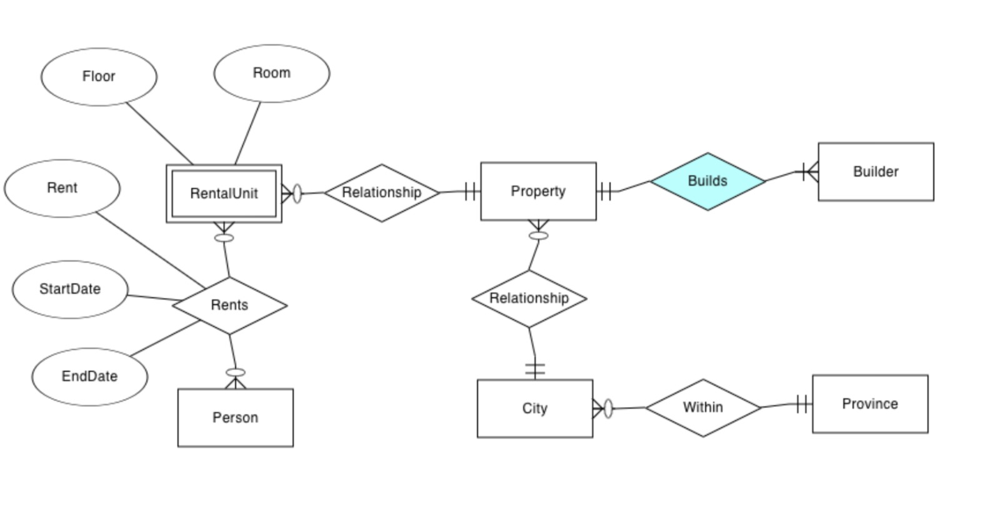
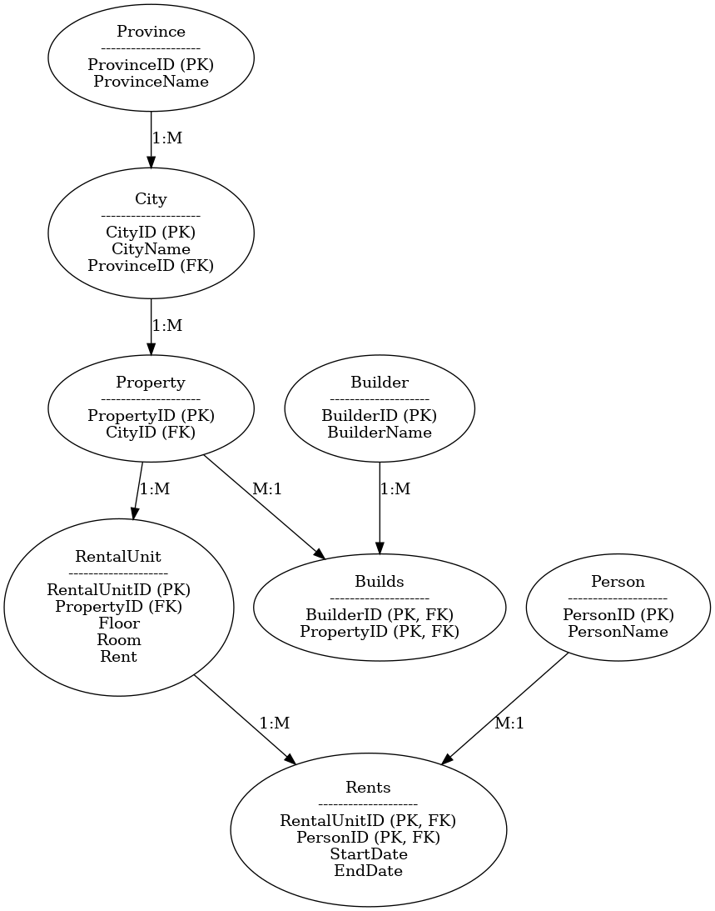

# CHEMUTAI-RENTAL-HOUSING-SYSTEM
## Project Overview
This project aims to design and implement a comprehensive database system to track housing availability, rental trends, and affordability in a structured manner. By organizing and analyzing rental data, the system can help policymakers, landlords, and housing agencies make informed decisions to address the crisis.

## Overview
This milestone focuses on converting the **Entity-Relationship (ER) model** from Milestone 1 into a **relational database model** and generating the necessary SQL scripts for implementation.

## Relational Database Design
The relational schema consists of the following tables:
- **Province (ProvinceID, ProvinceName)**
- **City (CityID, CityName, ProvinceID)** → *Linked to Province*
- **Property (PropertyID, CityID)** → *Linked to City*
- **Builder (BuilderID, BuilderName)**
- **Builds (BuilderID, PropertyID)** → *Many-to-Many Relationship between Builder & Property*
- **RentalUnit (RentalUnitID, PropertyID, Floor, Room, Rent)** → *Linked to Property*
- **Person (PersonID, PersonName)**
- **Rents (RentalUnitID, PersonID, StartDate, EndDate)** → *Tracks rental agreements*

The **Entity Model Diagram** visually represents these tables and relationships.


The **Relational Model Diagram** visually represents these tables and relationships.


## Source Code

* [Create Script (DDL](create.sql)
* [Populate Script (DML)](populate.sql)
* [Query Script (DML)](query.sql)

## Sample Queries

 
### Query 1

Retrieve All Rental Units and Their Details

```sql
SELECT 
    RentalUnitID, CityName, PropertyID, 
    Floor, Room, Rent 
FROM RentalUnit 
JOIN Property ON PropertyID = PropertyID
JOIN City ON CityID = CityID;
```

### Query 2
Find All Tenants and Their Rentals
```sql
SELECT 
    PersonName, RentalUnitID, Floor, Room, Rent, 
    CityName, ProvinceName, StartDate, EndDate 
FROM Rents
JOIN Person ON PersonID = PersonID
JOIN RentalUnit ON RentalUnitID = RentalUnitID
JOIN Property p ON PropertyID = PropertyID
JOIN City c ON CityID = CityID
JOIN Province ON ProvinceID = ProvinceID;
```

### Query 3
Find Available Rental Units (Units Not Rented)
```sql
SELECT RentalUnitID, CityName, Floor, Room, Rent
FROM RentalUnit 
JOIN Property ON PropertyID = PropertyID
LEFT JOIN Rents ON RentalUnitID = RentalUnitID
WHERE RentalUnitID IS NULL;
```